# FlowerStore - Advanced Systems Project - CIST 2931
- Team members: Destiny, Jacob, Jose, Nick, Salena and Trent
- Instructor: Ron Enz
- School: Chattahoochee Tech
- Semester: Fall 2023
## Project Description
In this project you will create a Web Application that may be used by Customers who are looking to buy “Flowers” online.  The Customers can place the order for delivery.

  A Customer Should be able to:
- [x] Search Web Site for different types of Flowers and Prices
- [x] Customers should be able to choose the card attached to the Flowers and the saying on the inside of the Card
- [x] Make a Purchase without creating a Customer Account
- [x] Create a new Customer Account
- [x] Login, Search Products and Make Purchases with their Customer Account
- [x] Change the information in their Customer Account, like Address, etc.

  An Order Processing Person Should be able to:
- [x] Login 
- [x] View a list of orders that need to be fulfilled
- [x] Change the state of an order from Open to Ready to Delivered

## Preview Screenshot
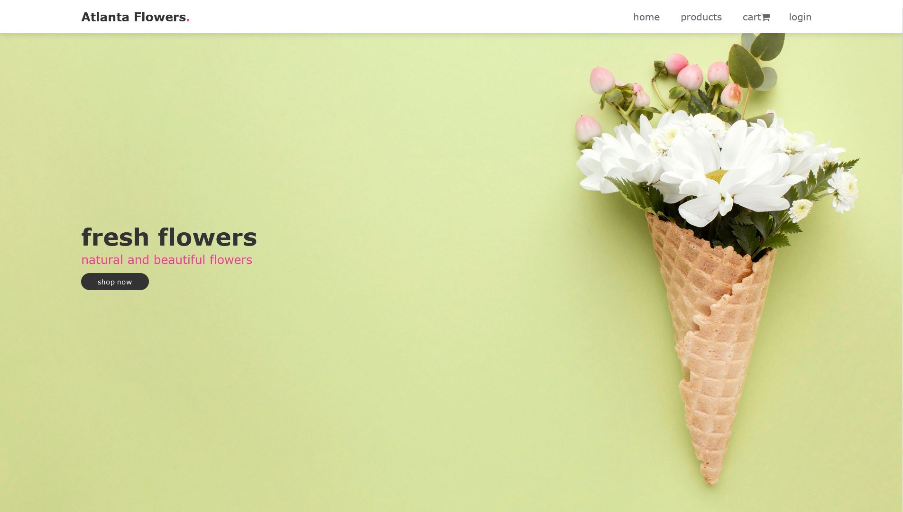 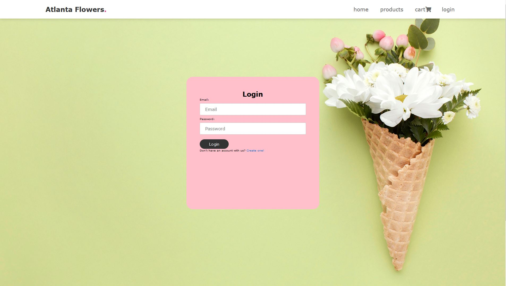
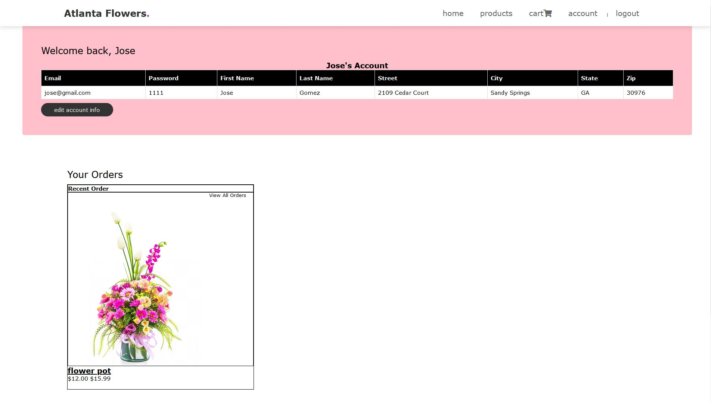 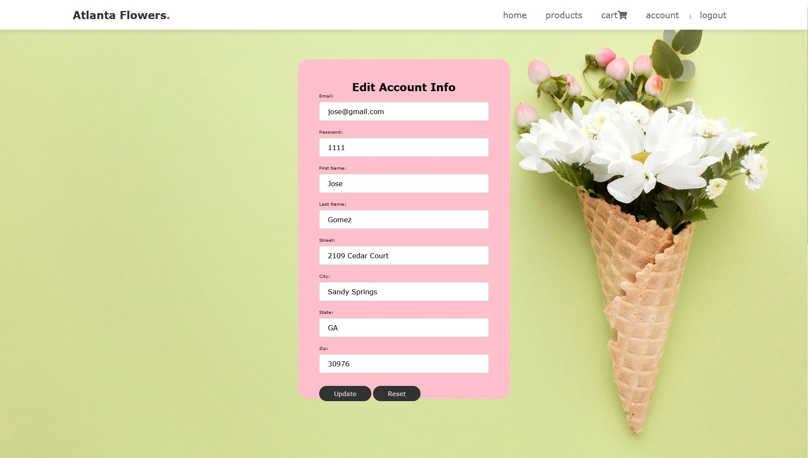
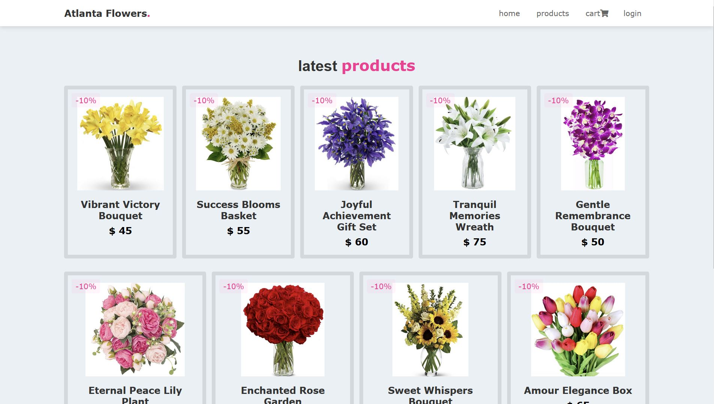 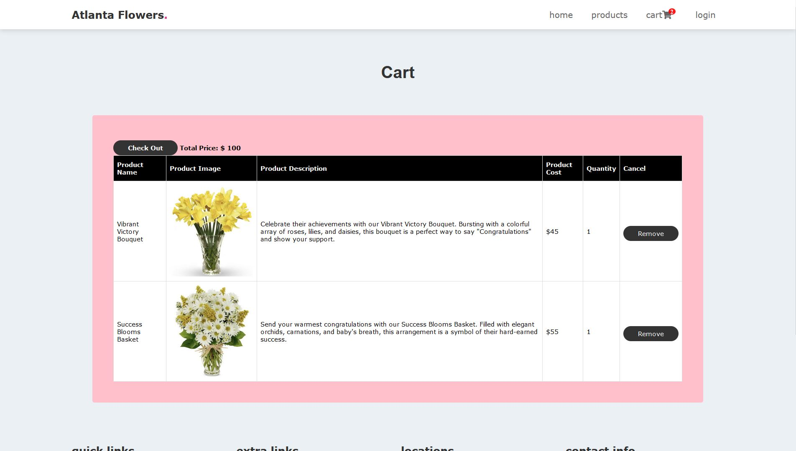
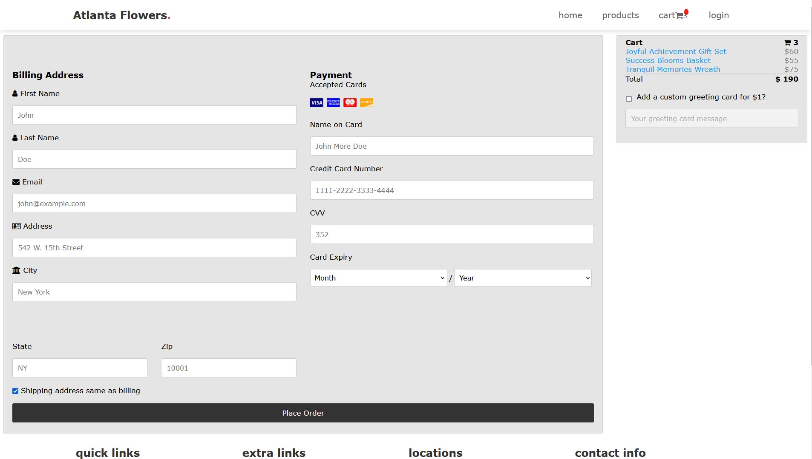 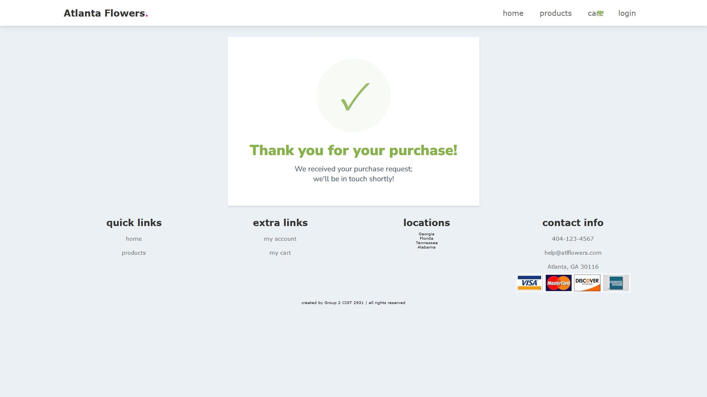
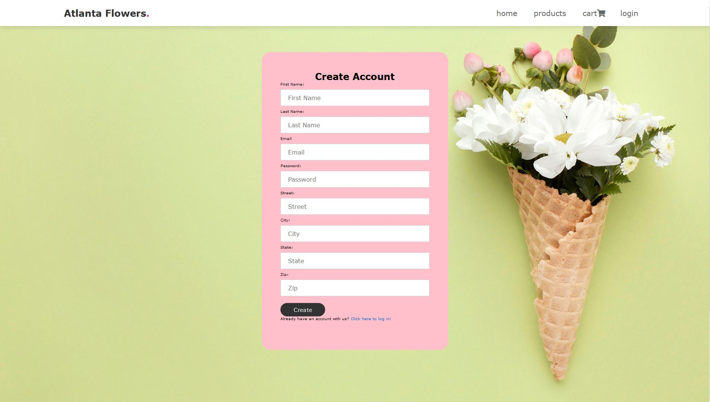 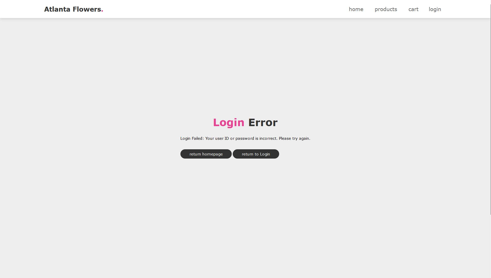 
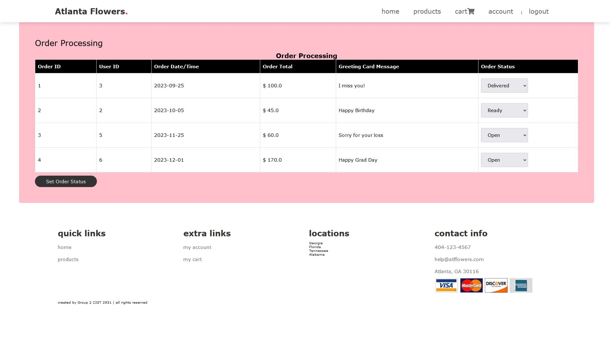

## Technology
1. Frontend
   - HTML, CSS, JavaScript
   - JSP JavaServer Pages
2. Backend
   - Servlets - a Java programming language class that is used to extend the capabilities of servers that host applications accessed by means of a request-response programming model
   - JDBC - Java Database Connectivity - a Java API to connect and execute the query with the database
3. Database
   - Microsoft Access - a database management system from Microsoft that combines the relational Access Database Engine with a graphical user interface and software-development tools
4. Tools
   - Netbeans 18
   - Java JDK 20
   - GlassFish Server

  

   
